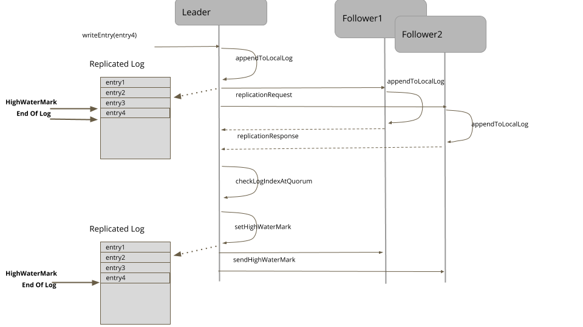
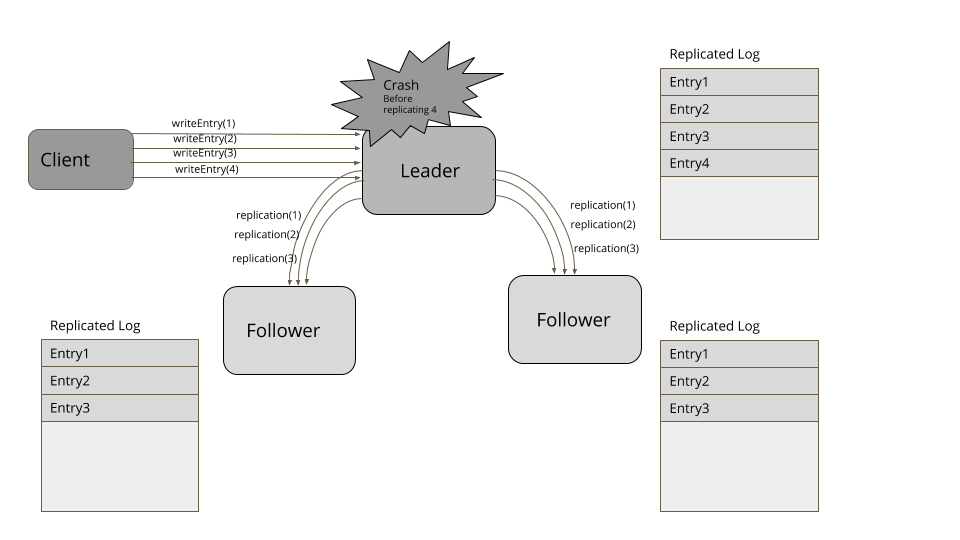
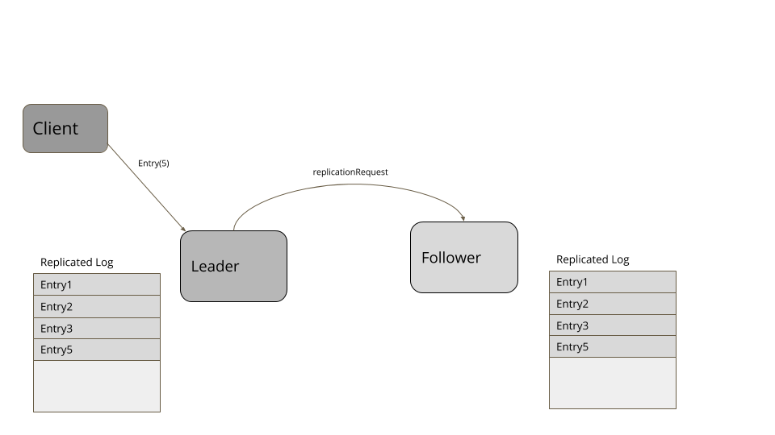
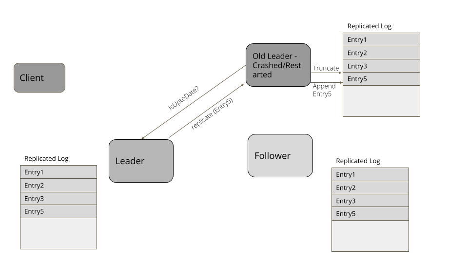

该文章翻译自 Martin Fowler 官方网站上的系列文章，原文链接 [Patterns of Distributed Systems](https://martinfowler.com/articles/patterns-of-distributed-systems/)，
此系列文章以宏观的视角系统地讲述了分布式系统中会遇到的一些问题及其解决方案，并将其归纳总结出相关的通用「模式」，这些「模式」对我们普通开发者了解学习分布式系统有很好的指导意义。

本篇文章原作者介绍了分布式系统中的 High-Water Mark 相关的概念及一些场景，
原文链接 [High-Water Mark](https://martinfowler.com/articles/patterns-of-distributed-systems/high-watermark.html) 。

注：高水位线（High-Water Mark）通常是指投资基金或账户达到的最高价值峰值。
这个词通常用于基金经理的报酬，而基金经理的报酬是基于业绩的。高水位线确保基金经理不会因为业绩不佳而获得大笔报酬。

<!--more--> 

## 正文

> 在预写式日志（Write Ahead Log）中，索引展现最新的成功复制的数据。

预写式日志（WAL）模式用于恢复服务器崩溃和重启后的服务状态。但在服务器故障时，预写日志还不足以提供可用性。
如果单个服务器发生故障，那么在服务器重启之前，客户端将无法运转。为了获得一个更可用的系统，我们可以将日志复制到多台服务器上。
使用 Leader and Followers 模式，Leader 将其所有的日志条目复制到 Followers 上。
现在如果 Leader 崩溃，可以选出一个新的 Leader，客户端大多可以继续像以前一样使用集群服务。但还是有几个场景会出现问题：

- Leader 在给任意一个 Follower  发送日志条目之前崩溃。
- Leader 在向小部分 Follower 发送日志条目之后崩溃，但无法继续将日志发送给大部分 Follower。

在这些出现错误的场景下，有些 Follower 的日志中可能缺少条目，有些 Follower 的日志条目可能比其他 Follower 多。
所以，对于每个 Follower 来说，知道哪部分的日志是安全的，并可以提供给客户端服务就变得非常重要。

### 解决方案

高水位标记（high-water mark）是日志文件中的一个索引，它记录了已知已成功复制到一定数量（符合 Quorum 机制的数量）的 Follower 的最后一个日志条目。
在复制过程中，Leader 也会将高水位标记传递给它的 Followers。群集中的所有服务器应仅传输或更新低于高水位线标记的数据给客户端。



对于每个日志条目，Leader 将其附加到其本地的预写日志中，然后将其发送给所有的 Follower。

```java
  private Long appendAndReplicate(byte[] data) {
      Long lastLogEntryIndex = appendToLocalLog(data);
      logger.info("Replicating log entries from index " + lastLogEntryIndex);
      replicateOnFollowers(lastLogEntryIndex);
      return lastLogEntryIndex;
  }

  private void replicateOnFollowers(Long entryAtIndex) {
      for (final FollowerHandler follower : followers) {
          replicateOn(follower, entryAtIndex); //send replication requests to followers
      }
  }
```

Follower 处理复制请求，并将日志条目追加到其本地日志中。在成功追加日志条目后，它们会将最新日志条目的索引响应给 Leader。
响应中还包括服务器当前的 [Generation Clock](https://martinfowler.com/articles/patterns-of-distributed-systems/generation.html)。

```java
  private ReplicationResponse handleReplicationRequest(ReplicationRequest replicationRequest) {
      List<WALEntry> entries = replicationRequest.getEntries();
      for (WALEntry entry : entries) {
          logger.info("Applying log entry " + entry.getEntryId() + " in " + serverId());
          wal.writeEntry(entry);
      }
      return new ReplicationResponse(SUCCEEDED, serverId(), replicationState.getGeneration(), wal.getLastLogEntryId());
  }
```

Leader 在收到响应时，会跟踪复制在每个服务器上的日志索引。

```java
  recordReplicationConfirmedFor(response.getServerId(), response.getReplicatedLogIndex());
  long logIndexAtQuorum = computeHighwaterMark(logIndexesAtAllServers(), config.numberOfServers());
  if (logIndexAtQuorum > replicationState.getHighWaterMark()) {
      var previousHighWaterMark = replicationState.getHighWaterMark();
      applyLogAt(previousHighWaterMark, logIndexAtQuorum);
      replicationState.setHighWaterMark(logIndexAtQuorum);
  }
```

高水位线可以通过查看 Follower 的日志索引及 Leader 自身的日志来计算，同时选出在多数服务器中都有的日志索引。

```java
  Long computeHighwaterMark(List<Long> serverLogIndexes, int noOfServers) {
      serverLogIndexes.sort(Long::compareTo);
      return serverLogIndexes.get(noOfServers / 2);
  }
```

在 Leader 选举中会出现一个微妙的问题。在任何服务器向客户端发送数据之前，我们必须确保集群中的所有服务器都有一个最新的日志记录。
这个微妙的问题就是，在向所有的 Follower 传播高水位线之前现有的 Leader 失效。RAFT 的做法是在 Leader 选举成功后，在 Leader 的日志中附加一个 no-op 条目，并且只有在其 Follower 确认这一点后才能为客户端提供服务。在 ZAB 中，新的 Leader 在尝试开始为客户提供服务之前，将其所有条目推送给所有的 Follower。

Leader 将高水位线作为常规心跳检测的一部分或作为单独的请求传播给 Followers。然后，Follower 据此设定他们的高水位线。

任何客户端都只能读取高水位线前日志条目。超过高水位线的日志条目对客户端来说是不可见的，因为没有确认这些条目是否被复制，
所以如果 Leader 失效，而其他服务器被选为 Leader，这些日志条目可能无法使用。

```java
  public WALEntry readEntry(long index) {
      if (index > replicationState.getHighWaterMark()) {
          throw new IllegalArgumentException("Log entry not available");
      }
      return wal.readAt(index);
  }
```

### 日志截断

当一台服务器在崩溃/重启后加入集群时，其日志中总有可能出现一些冲突的条目。因此，每当一台服务器加入集群时，
它都会与集群的 Leader 进行检查，以了解日志中哪些条目可能是冲突的。然后，它将日志截断到与 Leader 相匹配的条目，
然后用随后的条目更新日志，以确保它的日志与集群的其他条目相匹配。

考虑下面的例子。客户端发送请求在日志中添加四个条目。Leader 成功复制了三个条目，但在向自己的日志中添加 Entry4 之后失效。
其中一个 Follower 被选为新的 Leader，并从客户端接收到了更多的条目。当失效的 Leader 再次加入集群时，它的 Entry4 是冲突的。所以它需要截断自己的日志，直到 Entry3，然后添加 Entry5，使日志与集群的其他部分相匹配。

Leader 失效：


新 Leader：


日志截断：


任何在暂停后重新启动或重新加入集群的服务器都会找到新的 Leader。然后，它明确询问当前的高水位线，将自己的日志截断到高水位线，
然后从 Leader 那里得到高水位线以外的所有条目。RAFT 等复制算法有办法通过检查自己日志中的日志条目与请求中的日志条目，
找出冲突的条目，将日志索引相同但生成时钟较低的条目删除。

```java
  private void maybeTruncate(ReplicationRequest replicationRequest) throws IOException {
      if (replicationRequest.hasNoEntries() || wal.isEmpty()) {
          return;
      }

      List<WALEntry> entries = replicationRequest.getEntries();
      for (WALEntry entry : entries) {
          if (wal.getLastLogEntryId() >= entry.getEntryId()) {
              if (entry.getGeneration() == wal.readAt(entry.getEntryId()).getGeneration()) {
                  continue;
              }
              wal.truncate(entry.getEntryId());
          }
      }
  }
```

支持日志截断的一个简单的实现是保存一个日志索引和文件位置的 MAP。然后可以在给定的索引处对日志进行截断，如下所示：

```java
  public void truncate(Long logIndex) throws IOException {
      var filePosition = entryOffsets.get(logIndex);
      if (filePosition == null) throw new IllegalArgumentException("No file position available for logIndex=" + logIndex);

      fileChannel.truncate(filePosition);
  }
```

### 实际的应用示例

- 所有的共识算法都使用高水位标记的概念来知道何时应用所提出的状态突变，例如在 RAFT 共识算法中，高水位标记被称为 "CommitIndex"。
- 在 Kafka 复制协议中，维护了一个单独的索引，称为 "high-water mark"。消费者只能看到高水位标记之前的条目。
- Apache BookKeeper 有一个「[最后一次添加确认](https://bookkeeper.apache.org/archives/docs/r4.4.0/bookkeeperProtocol.html)」的概念，即在 Quorum 的法定人数上成功复制的条目。
