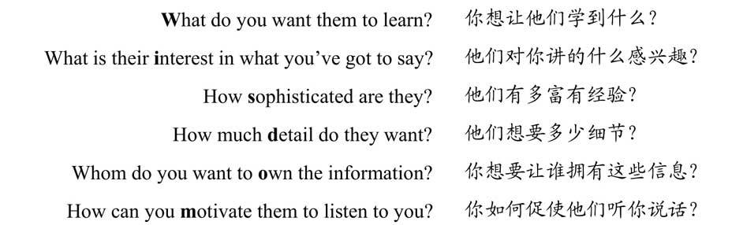
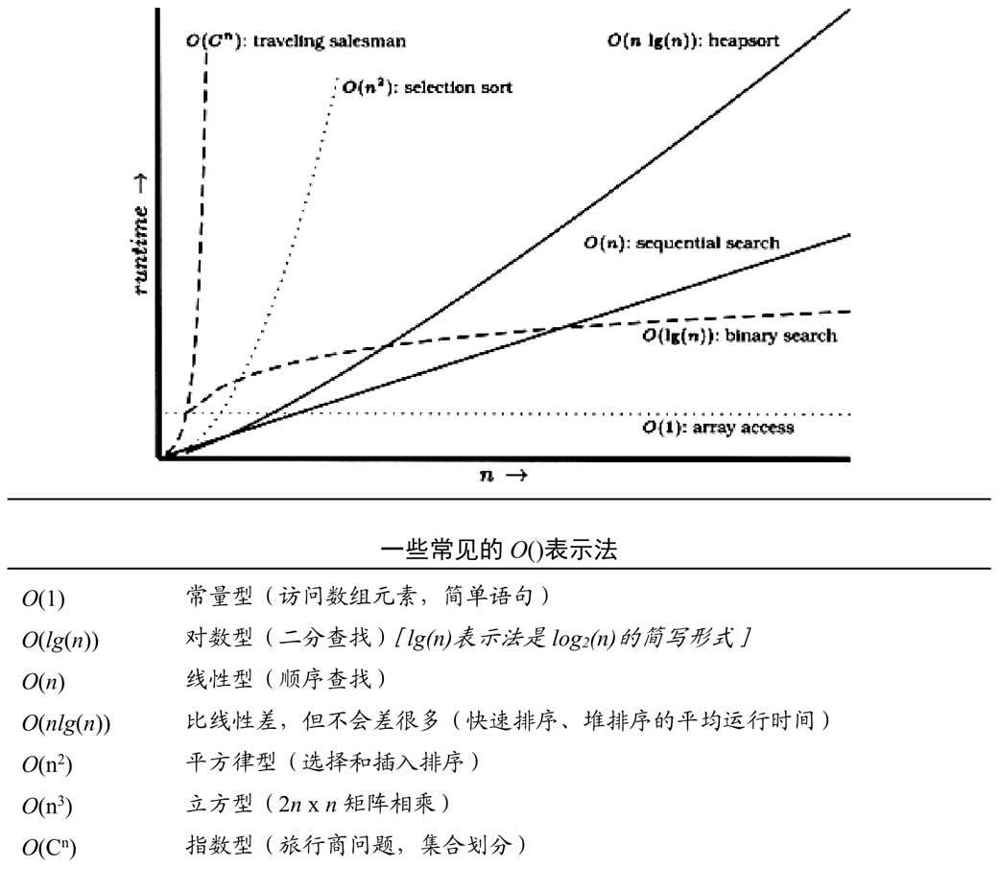

## 我的源码让猫给吃了

依据你的职业发展、你的项目和你每天的工作，为你自己和你的行为负责这样一种观念，是注重实效的哲学的一块基石。注重实效的程序员对他或她自己的职业生涯负责，并且不害怕承认无知或错误。

**Provide Options, Don't Make Lame Excuses 提供各种选择，不要找蹩脚的借口** 

## 软件的熵

尽管软件开发几乎不受任何物理定律的约束，熵（entropy）对我们的影响却很大。熵是一个来自物理学的概念，指的是某个系统中的「无序」的总量。遗憾的是，热力学定律保证了宇宙中的熵倾向于最大化。当软件中的无序增长时，程序员们称之为「软件腐烂」（software rot）。 

**Don't Live with Broken Windows 不要容忍破窗户** 

置之不理都会更快地加速腐烂的进程 

## 石头汤与煮青蛙

**Be a Catalyst for Change 做变化的催化剂** 

**Remember the Big Picture 记住大图景**

## 足够好的软件

**Make Quality a Requirements Issue 使质量成为需求问题**

不要因为过度修饰和过于求精而毁损完好的程序。继续前进，让你的代码凭着自己的质量站立一会儿。它也许不完美，但不用担心：它不可能完美。

## 你的知识资产

管理知识资产与管理金融资产非常相似：

1. 严肃的投资者定期投资——作为习惯。
2. 多元化是长期成功的关键。
3. 聪明的投资者在保守的投资和高风险、高回报的投资之间平衡他们的资产。
4. 投资者设法低买高卖，以获取最大回报。
5. 应周期性地重新评估和平衡资产。

**Invest Regularly in Your Knowledge Portfolio 定期为你的知识资产投资**

学习的过程将扩展你的思维，使你向着新的可能性和新的做事方式拓展。思想的「异花授粉」（cross-pollination）十分重要；设法把你学到的东西应用到你当前的项目中。即使你的项目没有使用该技术，你或许也能借鉴一些想法。

批判地思考你读到的和听到的。你需要确保你的资产中的知识是准确的，并且没有受到供应商或媒体炒作的影响。警惕声称他们的信条提供了唯一答案的狂热者——那或许适用、或许不适用于你和你的项目。

**Critically Analyze What You Read and Hear 批判地分析你读到的和听到的**

- 确切地知道你想要问什么，并尽量明确具体。
- 小心而得体地组织你的问题。记住你是在请求帮助；不要显得好像是在要求对方回答。
- 组织好问题之后，停下来，再找找答案。选出一些关键字，搜索 Web。查找适当的 FAQ （常见问题的解答列表）。
- 决定你是想公开提问还是私下提问。
- 坐回椅子上，耐心等候。人们很忙，也许需要几天才能得到明确的答案。

## 交流

没有有效的交流，一个好想法就只是一个无人关心的孤儿。

**It's Both What You Say and the Way You Say It 你说什么和你怎么说同样重要**

## 重复的危害

系统中的每一项知识都必须具有单一、无歧义、权威的表示。

**DRY-Don't Repeat Yourself 不要重复你自己**

糟糕的代码才需要许多注释。DRY 法则告诉我们，要把低级的知识放在代码中，它属于那里；把注释保留给其他的高级说明。否则，我们就是在重复知识，而每一次改变都意味着既要改变代码，也要改变注释。注释将不可避免地变得过时，而不可信任的注释比完全没有注释更糟。

**Make It Easy to Reuse 让复用变得容易** 

## 正交性

「正交性」是从几何学中借来的术语。如果两条直线相交成直角，它们就是正交的，比如图中的坐标轴。用向量术语说，这两条直线互不依赖。沿着某一条直线移动，你投影到另一条直线上的位置不变。

在计算技术中，该术语用于表示某种不相依赖性或是解耦性。如果两个或更多事物中的一个发生变化，不会影响其他事物，这些事物就是正交的。在设计良好的系统中，数据库代码与用户界面是正交的：你可以改动界面，而不影响数据库；更换数据库，而不用改动界面。

非正交系统的改变与控制更复杂是其固有的性质。当任何系统的各组件互相高度依赖时，就不再有局部修正（local fix）这样的事情。

**Eliminate Effects Between Unrelated Things 消除无关事物之间的影响**

## 曳光弹

曳光代码并非用过就扔的代码：你编写它，是为了保留它。它含有任何一段产品代码都拥有的完整的错误检查、结构、文档、以及自查。它只不过功能不全而已。但是，一旦你在系统的各组件间实现了端到端（end-to-end）的连接，你就可以检查你离目标还有多远，并在必要的情况下进行调整。一旦你完全瞄准，增加功能将是一件容易的事情。 

曳光代码也是如此。你在不能100%确定该去往何处的情形下使用这项技术。如果最初的几次尝试错过了目标——用户说：「那不是我的意思」，你需要的数据在你需要它时不可用，或是性能好像有问题——你不应感到惊奇。找出怎样改变已有的东西、让其更接近目标的办法，并且为你使用了一种简约的开发方法而感到高兴。小段代码的惯性也小——要改变它更容易、更迅速。你能够搜集关于你的应用的反馈，而且与其他任何方法相比，你能够花费较少代价、更为迅速地生成新的、更为准确的版本。同时，因为每个主要的应用组件都已表现在你的曳光代码中，用户可以确信，他们所看到的东西具有现实基础，不仅仅是纸上的规范。 

原型制作生成用过就扔的代码。曳光代码虽然简约，但却是完整的，并且构成了最终系统的骨架的一部分。你可以把原型制作视为在第一发曳光弹发射之前进行的侦察和情报搜集工作。 

## 领域语言

**Program Close to the Problem domain 靠近问题领域编程**

通过在更高的抽象层面上编码，你获得了专心解决领域问题的自由，并且可以忽略琐碎的实现细节。

## 估算

**Estimate to Avoid Surprises 估算，以避免发生意外**

## 纯文本的威力

**Keep Knowledge in Plain Text 用纯文本保存知识**

使用纯文本有两个主要缺点：

1. 与压缩的二进制格式相比，存储纯文本所需空间更多。
2. 要解释及处理纯文本文件，计算上的代价可能更昂贵。

人能够阅读的数据形式，以及自描述的数据，将比所有其他的数据形式和创建它们的应用都活得更长久。

对于大多数二进制文件，要成功地进行解析，你必须了解整个格式的所有细节。

## shell 游戏

GUI 的好处是 WYSIWYG——所见即所得（what you see is what you get）。缺点是 WYSIAYG——所见即全部所得（what you see is all you get）。 

**Use the Power of Command Shells 利用命令 shell 的力量**

## 强力编辑

**Use a Single Editor Well 用好一种编辑器**

## 源码控制

*进步远非由变化组成，而是取决于好记性。不能记住过去的人，被判重复过去。——George Santayana, Life of Reason*

**Always Use Source Code Control 总是使用源码控制**

## 调试

**Fix the Problem, Not the Blame 要修正问题，而不是发出指责**

如果你目睹 bug 或见到 bug 报告时的第一反应是「那不可能」，你就完全错了。一个脑细胞都不要浪费在以「但那不可能发生」起头的思路上，因为很明显，那不仅可能，而且已经发生了。

在调试时小心「近视」。要抵制只修正你看到的症状的急迫愿望：更有可能的情况是，实际的故障离你正在观察的地方可能还有几步远，并且可能涉及许多其他的相关事物。要总是设法找出问题的根源，而不只是问题的特定表现。

找到问题的原因的一种非常简单、却又特别有用的技术是向别人解释它。他应该越过你的肩膀看着屏幕，不断点头（像澡盆里上下晃动的橡皮鸭）。他们一个字也不需要说；你只是一步步解释代码要做什么，常常就能让问题从屏幕上跳出来，宣布自己的存在。

记住，如果你看到马蹄印，要想到马，而不是斑马。OS 很可能没有问题。数据库也很可能情况良好。

某样东西出错时，你感到吃惊的程度与你对正在运行的代码的信任及信心成正比。这就是为什么，在面对「让人吃惊」的故障时，你必须意识到你的一个或更多的假设是错的。不要因为你「知道」它能工作而轻易放过与 bug 有牵连的例程或代码。证明它。用这些数据、这些边界条件、在这个语境中证明它。

**Don't Assume it Prove It 不要假定，要证明**

## 文本操纵

**Learn a Text Manipulation Language 学习一种文本操纵语言**

## 代码生成器

**Write Code That Writes Code 编写能编写代码的代码**

## 注重实效的偏执

**You Can't Write Perfect Software 你不可能写出完美的软件**

## 按合约设计

**Design with Contracts 通过合约进行设计** 

## 死程序不说谎

**Crash Early 早崩溃要崩溃，不要破坏（trash）** 

## 断言式编程

**If It Can't Happen, Use Assertions to Ensure That It Won't 如果它不可能发生，用断言确保它不会发生**

## 何时使用异常

「如果我移走所有的异常处理器，这些代码是否仍然能运行？」如果答案是「否」，那么异常也许就正在被用在非异常的情形中。 

**Use Exceptions for Exceptional Problems 将异常用于异常的问题**

异常表示即时的、非局部的控制转移——这是一种级联的（cascading）goto。 

## 怎样配平资源

只要在编程，我们都要管理资源：内存、事务、线程、文件、定时器——所有数量有限的事物。大多数时候，资源使用遵循一种可预测的模式：你分配资源、使用它，然后解除其分配。

对于一次需要不只一个资源的例程，可以对资源分配的基本模式进行扩展。有两个另外的建议：

1. 以与资源分配的次序相反的次序解除资源的分配。这样，如果一个资源含有对另一个资源的引用，你就不会造成资源被遗弃。
2. 在代码的不同地方分配同一组资源时，总是以相同的次序分配它们。这将降低发生死锁的可能性。（如果进程 A 申请了 resource1，并正要申请 resource2，而进程 B 申请了 resource2，并试图获得 resource1，这两个进程就会永远等待下去。） 

## 解耦与得墨忒耳法则

**Minimize Coupling Between Modules 使模块之间的耦合减至最少**

## 元程序设计

**Configure, Don't Integrate 要配置，不要集成**

要用元数据（metadata）描述应用的配置选项：调谐参数、用户偏好（user preference）、安装目录，等等。

**Put Abstractions in Code, Details in Metadata 将抽象放进代码，细节放进元数据** 

## 时间耦合

时间是软件架构的一个常常被忽视的方面。吸引我们的时间只是进度表上的时间，发布之前我们剩余的时间——但这不是我们这里在谈论的时间。相反，我们谈论的是，作为软件自身的一种设计要素的时间的角色。时间有两个方面对我们很重要：**并发**（事情在同一时间发生）和**次序**（事情在时间中的相对位置）。 

我们需要容许并发，并考虑解除任何时间或次序上的依赖。这样做，我们可以获得灵活性，并减少许多开发领域中的任何基于时间的依赖：工作流分析、架构、设计、还有部署。 

**Analyze Workflow to Improve Concurrency 分析工作流，以改善并发性** 

Design Using Services 用服务进行设计实际上我们创建的不是组件，而是服务——位于定义良好的、一致的接口之后的独立、并发的对象。

**Always Design for Concurrency 总是为并发进行设计**

## 靠巧合编程

**Don't Program by Coincidence 不要靠巧合编程** 

不要做历史的奴隶。不要让已有的代码支配将来的代码。如果不再适用，所有的代码都可被替换。即使是在一个程序中，也不要让你已经做完的事情约束你下一步要做的事情——准备好进行重构。

## 算法速率

把 ***O*** 视为「阶为……」（on the order of）的意思。***O( )*** 表示法对我们在度量的事物（时间、内存，等等）的值设置了上限。 

嵌套循环。如果你需要在循环中嵌套另外的循环，那么你的算法就变成了***O(m x n)*** ，这里的 m 和 n 是两个循环的界限。 

这通常发生在简单的排序算法中，比如冒泡排序：外循环依次扫描数组中的每个元素，内循环确定在排序结果的何处放置该元素。这样的排序算法往往是 ***O(n2)*** 。

简单循环。如果某个简单循环从 1 运行到 n，那么算法很可能就是 ***O(n)*** ——时间随 n 线性增加。其例子有穷举查找、找到数组中的最大值、以及生成校验和。 

二分法。如果你的算法在每次循环时把事物集合一分为二，那么它很可能是对数型 ***O(lg(n))*** 算法 

对有序列表的二分查找、遍历二杈树、以及查找机器字中的第一个置位了的位，都可能是 ***O(ln(n))*** 算法。 

分而治之。划分其输入，并独立地在两个部分上进行处理，然后再把结果组合起来的算法可能是 ***O(nln(n))*** 。经典例子是快速排序，其工作方式是：把数据划分为两半，并递归地对每一半进行排序。尽管在技术上是 ***O(n2)*** ，但因为其行为在馈入的是排过序的输入时会退化，快速排序的平均运行时间是 ***O(nln(n))*** 。 

组合。只要算法考虑事物的排列，其运行时间就有可能失去控制。这是因为排列涉及到阶乘（从数字1 到 5 有 5！=5×4×3×2×1=120 种排列）。得出 5 个元素的组合算法所需的时间：6 个元素需要 6 倍的时间，7 个元素则需要 42 倍的时间。其例子包括许多公认的难题的算法——旅行商问题、把东西最优地包装进容器中、划分一组数、使每一组都有相同的总和，等等。在特定问题领域中，常常用启发式方法（heuristics）减少这些类型的算法的运行时间。

## 重构

与建筑相比，软件更像是园艺——它比混凝土更有机。你根据最初的计划和各种条件在花园里种植许多花木。有些花木茁壮成长，另一些注定要成为堆肥。你可能会改变植株的相对位置，以有效利用光影、风雨的交互作用。过度生长的植株会被分栽或修剪，颜色不协调的会被移栽到从美学上看更怡人的地方。你拔除野草，并给需要额外照料的植株施肥。你不断关注花园的兴旺，并按照需要（对土壤、植株、布局）做出调整。 

把需要重构的代码当作是一种「肿瘤」。切除它需要进行「侵入性」的外科手术。你可以现在手术，趁它还小把它取出来。你也可以等它增大并扩散——但那时再切除它就会更昂贵、更危险。等得再久一点，「病人」就有可能会丧命。 

1. 不要试图在重构的同时增加功能。
2. 在开始重构之前，确保你拥有良好的测试。尽可能经常运行这些测试。这样，如果你的改动破坏了任何东西，你就能很快知道。 

## 易于测试的代码

软件的单元测试是对模块进行演练的代码。在典型情况下，单元测试将建立某种人工环境，然后调用被测试模块中的例程。然后，它根据已知的值，或是同一测试先前返回的结果（回归测试），对返回的结果进行检查。

## 需求之坑

*完美，不是在没有什么需要增加、而是在没有什么需要去掉时达到的。——Antoine de St.Exupery, Wind, Sand, and Stars,1939* 

**Don't Gather Requirements-Dig for Them 不要搜集需求——挖掘它们** 

当你在尘土里四处挖掘时，你怎样才能识别出真实的需求？答案既简单又复杂。简单的回答是，需求是对需要完成的某件事情的陈述。 

找出用户为何要做特定事情的原因、而不只是他们目前做这件事情的方式，这很重要。到最后，你的开发必须解决他们的商业问题，而不只是满足他们陈述的需求。

**Work with a User to Think Like a User 与用户一同工作，以像用户一样思考**

制作需求文档时的一大危险是太过具体。好的需求文档会保持抽象。在涉及需求的地方，最简单的、能够准确地反映商业需要的陈述是最好的。这并非意味着你可以含糊不清——你必须把底层的语义不变项当作需求进行捕捉，并把具体的或当前的工作实践当作政策记入文档。需求不是架构。需求不是设计，也不是用户界面。需求是需要。

**Abstractions Live Longer than Details 抽象比细节活得更长久** 

许多项目的失败都被归咎于项目范围的增大——也称为特性膨胀（feature bloat）、蔓延特性论（creeping featurism）、或是需求蔓延（requirement creep）。

要创建并维护项目词汇表（project glossary）——这是定义项目中使用的专用术语和词汇的地方。项目的所有参与者，从最终用户到支持人员，都应该使用这个词汇表，以确保一致性。这就意味着，可以访问词汇表的人员范围应该很广泛——这是采用基于 Web 的文档的一个有效论据。

## 解开不可能解开的谜题

流行的俗话「在盒子外面思考」鼓励我们找出可能不适用的约束，并忽略它们。但这个俗话并不完全准确。如果「盒子」是各种约束和条件的边界，那么诀窍就在于找到盒子——它可能比你以为的要大得多。

**Don't Think Outside the Box-Find the Box 不要在盒子外面思考——要找到盒子**

在面对棘手的问题时，列出所有在你面前的可能途径。不要排除任何东西，不管它听起来有多无用或愚蠢。现在，逐一检查列表中的每一项，并解释为何不能采用某个特定的途径。你确定吗？你能否证明？ 

有时你会发现，自己在处理的问题似乎比你以为的要难得多。感觉上好像是你走错了路——一定有比这更更容易的方法！或许现在你已落在了进度表后面，甚或失去了让系统工作起来的信心，因为这个特定的问题是「不可能解决的」。这正是你退回一步，问问自己以下问题的时候：有更容易的方法吗？你是在设法解决真正的问题，还是被外围的技术问题转移了注意力？这件事情为什么是一个问题？是什么使它如此难以解决？它必须以这种方式完成吗？它真的必须完成吗？很多时候，当你设法回答这些问题时，你会有让自己吃惊的发现。很多时候，对需求的重新诠释能让整个问题全都消失——就像是戈尔迪斯结。 

## 等你准备好

**Listen to Nagging Doubts-Start When You're Ready 倾听反复出现的疑虑——等你准备好再开始** 

## 规范陷阱

**Some Things Are Better Done than Described 对有些事情「做」胜于「描述」** 

## 圆圈与箭头

还有一些开发者，在有许多已沉没项目的大海里漂流，不断抓住最新的时尚，就像是遇到海难的人紧紧抓住漂来的木头一样。每当有新的木头漂过时，他们都会费力地游过去，希望这一块会更好。但到最后，不管漂浮物有多好，这些开发者仍然漫无目的地漂流着。

**Don't Be a Slave to Formal Methods 不要做形式方法的奴隶**

## 注重实效的团队

**Organize Around Functionality, Not Job Functions 围绕功能、而不是工作职务进行组织** 

## 无情的测试

**Coding Ain't Done'Til All the Tests Run 要到通过全部测试，编码才算完成**

**Use Saboteurs to Test Your Testing 通过「蓄意破坏」测试你的测试**

**Test State Coverage, Not Code Coverage 测试状态覆盖，而不是代码覆盖**

## 极大的期望

在抽象的意义上，应用如果能正确实现其规范，就是成功的。遗憾的是，这只能付抽象的账。在现实中，项目的成功是由它在多大程度上满足了用户的期望来衡量的。不符合用户预期的项目注定是失败的，不管交付的产品在绝对的意义上有多好。

**Gently Exceed Your Users' Expectations 温和地超出用户的期望**

## 傲慢与偏见

我们想要看到对所有权的自豪。「这是我编写的，我对自己的工作负责。」你的签名应该被视为质量的保证。当人们在一段代码上看到你的名字时，应该期望它是可靠的、用心编写的、测试过的和有文档的，一个真正的专业作品，由真正的专业人员编写。

## 建设藏书库

### 分析与设计

- 《Object-Oriented Software Construction，2nd Edition》 Bertrand Meyer 的史诗般的著作，论述面向对象开发的基本原理。
- 《Design Patterns》设计模式在比编程语言惯用手法更高的层面上描述解决特定类型的问题的途径。这本由 Gang of Four 撰写、现已成为经典的书籍描述了23种基本的设计模式，包括 Proxy、Visitor 和 Singleton，等等。
- 《Analysis Patterns》一个高级架构型模式的宝藏，取自广泛的真实项目，「蒸馏」成书籍的形式。相对快速地深入了解多年建模经验的途径。

### 团队与项目

- 《The Mythical Man Month》 Fred Brooks 的经典著作，论述项目团队组织的各种危险，最近作了修订。
- 《Dynamics of Software Development》一系列论述大型团队软件构建的短文，着重讨论团队成员之间、团队与外界之间的动力机制。
- 《Surviving Object-Oriented Projects: A Manager’s Guide》 Alistair Cockburn 的「战地报导」，阐释OO项目管理的许多危险和陷阱——特别是你的第一个项目。Cockburn 先生提供了能让你解决最常见问题的提示与技术。

## 注重实效的程序员之快速参考指南 The Pragmatic Programmer Quick Reference Guide

1. 关心你的技艺 Care About Your Craft。如果你不在乎能否漂亮地开发出软件，你又为何要耗费生命去开发软件呢？
2. 思考！你的工作 Think! About Your Work。关掉自动驾驶仪，接管操作。不断地批评和评估你的工作。
3. 提供各种选择，不要找蹩脚的借口 Provide Options, Don't Make Lame Excuses 要提供各种选择，而不是找借口。不要说事情做不到；说明能够做什么。
4. 不要容忍破窗户 Don't Live with Broken Windows 当你看到糟糕的设计、错误的决策和糟糕的代码时，修正它们。
5. 做变化的催化剂 Be a Catalyst for Change 你不能强迫人们改变。相反，要向他们展示未来可能会怎样，并帮助他们参与对未来的创造。
6. 记住大图景 Remember the Big Picture 不要太过专注于细节，以致忘了查看你周围正在发生什么。
7. 使质量成为需求问题 Make Quality a Requirements Issue 让你的用户参与确定项目真正的质量需求。
8. 定期为你的知识资产投资 Invest Regularly in Your Knowledge Portfolio 让学习成为习惯。
9. 批判地分析你读到的和听到的 Critically Analyze What You Read and Hear 不要被供应商、媒体炒作、或教条左右。要依照你自己的看法和你的项目的情况去对信息进行分析。
10. 你说什么和你怎么说同样重要 It's Both What You Say and the Way You Say It 如果你不能有效地向他人传达你的了不起的想法，这些想法就毫无用处。
11. 不要重复你自己 DRY-Don't Repeat Yourself 系统中的每一项知识都必须具有单一、无歧义、权威的表示。
12. 让复用变得容易 Make It Easy to Reuse 如果复用很容易，人们就会去复用。创造一个支持复用的环境。
13. 消除无关事物之间的影响 Eliminate Effects Between Unrelated Things 设计自足、独立、并具有单一、良好定义的目的的组件。
14. 不存在最终决策 There Are No Final Decisions 没有决策是浇铸在石头上的。相反，要把每项决策都视为是写在沙滩上的，并为变化做好计划。
15. 用曳光弹找到目标 Use Tracer Bullets to Find the Target 曳光弹能通过试验各种事物并检查它们离目标有多远来让你追踪目标。
16. 为了学习而制作原型 Prototype to Learn 原型制作是一种学习经验。其价值并不在于所产生的代码，而在于所学到的经验教训。
17. 靠近问题领域编程 Program Close to the Problem domain 用你的用户的语言进行设计和编码。
18. 估算，以避免发生意外 Estimate to Avoid Surprises 在着手之前先进行估算。你将提前发现潜在的问题。
19. 通过代码对进度表进行迭代 Iterate the Schedule with the Code 用你在进行实现时获得的经验提炼项目的时间标度。
20. 用纯文本保存知识 Keep Knowledge in Plain Text 纯文本不会过时。它能够帮助你有效利用你的工作，并简化调试和测试。
21. 利用命令shell的力量 Use the Power of Command Shells 当图形用户界面无能为力时使用 shell。
22. 用好一种编辑器 Use a Single Editor Well 编辑器应该是你的手的延伸；确保你的编辑器是可配置、可扩展和可编程的。
23. 总是使用源码控制 Always Use Source Code Control 源码控制是你的工作的时间机器——你能够回到过去。
24. 要修正问题，而不是发出指责 Fix the Problem, Not the Blame bug 是你的过错还是别人的过错，并不是真的很有关系——它仍然是你的问题，它仍然需要修正。
25. 不要恐慌 Don't Panic When Debuging 做一次深呼吸，思考什么可能是bug的原因。
26. ”Select” 没有问题 "Select" Isn't Broken 在 OS 或编译器、甚或是第三方产品或库中很少发现 bug。bug 很可能在应用中。
27. 不要假定，要证明 Don't Assume It-Prove It 在实际环境中——使用真正的数据和边界条件——证明你的假定。
28. 学习一种文本操纵语言 Learn a Text Manipulation Language 你用每天的很大一部分时间处理文本，为什么不让计算机替你完成部分工作呢？
29. 编写能编写代码的代码 Write Code That Writes Code 代码生成器能提高你的生产率，并有助于避免重复。
30. 你不可能写出完美的软件 You Can't Write Perfect Software 软件不可能完美。保护你的代码和用户，使它（他）们免于能够预见的错误。
31. 通过合约进行设计 Design with Contracts 使用合约建立文档，并检验代码所做的事情正好是它声明要做的。
32. 早崩溃 Crash Early 死程序造成的危害通常比有问题的程序要小得多。
33. 用断言避免不可能发生的事情 Use Assertions to Prevent the Impossible 断言验证你的各种假定。在一个不确定的世界里，用断言保护你的代码。
34. 将异常用于异常的问题 Use Exceptions for Exceptional Problems 异常可能会遭受经典的意大利面条式代码的所有可读性和可维护性问题的折磨。将异常保留给异常的事物。
35. 要有始有终 Finish What You Start 只要可能，分配某资源的例程或对象也应该负责解除其分配。
36. 使模块之间的耦合减至最少 Minimize Coupling Between Modules 通过编写「羞怯的」代码并应用得墨忒耳法则来避免耦合。
37. 要配置，不要集成 Configure, Don't Integrate 要将应用的各种技术选择实现为配置选项，而不是通过集成或工程方法实现。
38. 将抽象放进代码，细节放进元数据 Put Abstractions in Code, Details in Metadata 为一般情况编程，将细节放在被编译的代码库之外。
39. 分析工作流，以改善并发性 Analyze Workflow to Improve Concurrency 利用你的用户的工作流中的并发性。
40. 用服务进行设计 Design Using Services 根据服务——独立的、在良好定义、一致的接口之后的并发对象——进行设计。
41. 总是为并发进行设计 Always Design for Concurrency 容许并发，你将会设计出更整洁、具有更少假定的接口。
42. 使视图与模型分离 Separate Views from Models 要根据模型和视图设计你的应用，从而以低廉的代码获取灵活性。
43. 用黑板协调工作流 Use Blackboards to Coordinate Workflow 用黑板协调完全不同的事实和因素，同时又使各参与方保持独立和隔
44. 不要靠巧合编程 Don't Program by Coincidence 只依靠可靠的事物。注意偶发的复杂性，不要把幸运的巧合与有目的的计划混为一谈。
45. 估算你的算法的阶 Estimate the Order of Your Algorithms 在你编写代码之前，先大致估算事情需要多长时间。
46. 测试你的估算 Test Your Estimates 对算法的数学分析并不会告诉你每一件事情。在你的代码的目标环境中测定它的速度。
47. 早重构，常重构 Refactor Early, Refactor Often 就和你会在花园里除草、并重新布置一样，在需要时对代码进行重写、重做和重新架构。要铲除问题的根源。
48. 为测试而设计 Design to Test 在你还没有编写代码时就开始思考测试问题。
49. 测试你的软件，否则你的用户就得测试 Test Your Software, or Your Users Will 无情地测试。不要让你的用户为你查找 bug。
50. 不要使用你不理解的向导代码 Don't Use Wizard Code You Don't Understand 向导可以生成大量代码。在你把它们合并进你的项目之前，确保你理解全部这些代码。
51. 不要搜集需求——挖掘它们 Don't Gather Requirements-Dig for Them 需求很少存在于表面上。它们深深地埋藏在层层假定、误解和政治手段的下面。
52. 与用户一同工作，以像用户一样思考 Work with a User to Think Like a User 要了解系统实际上将如何被使用，这是最好的方法。
53. 抽象比细节活得更长久 Abstractions Live Longer than Details 「投资」于抽象，而不是实现。抽象能在来自不同的实现和新技术的变化的「攻击」之下存活下去。
54. 使用项目词汇表 Use a Project Glossary 创建并维护项目中使用的专用术语和词汇的单一信息源。
55. 不要在盒子外面思考——要找到盒子 Don't Think Outside the Box-Find the Box 在遇到不可能解决的问题时，要确定真正的约束。问问你自己：「它必须以这种方式完成吗？它真的必须完成吗？」
56. 等你准备好再开始 Start When You're Ready 你的一生都在积累经验。不要忽视反复出现的疑虑。
57. 对有些事情「做」胜于「描述」Some Things Are Better Done than Described 不要掉进规范的螺旋——在某个时刻，你需要开始编码。
58. 不要做形式方法的奴隶 Don't Be a Slave to Formal Methods 如果你没有把某项技术放进你的开发实践和能力的语境中，不要盲目地采用它。
59. 昂贵的工具不一定能制作出更好的设计 Costly Tools Don't Produce Better Designs 小心供应商的炒作，行业教条、以及价格标签的诱惑。要根据工具的价值判断它们。
60. 围绕功能组织团队 Organize Teams Around Functionality 不要把设计师与编码员分开，也不要把测试员与数据建模员分开。按照你构建代码的方式构建团队。
61. 不要使用手工流程 Don't Use Manual Procedures shell 脚本或批文件会一次次地以同一顺序执行同样的指令。
62. 早测试，常测试，自动测试。Test Early. Test Often. Test Automatically 与呆在书架上的测试计划相比，每次构建时运行的测试要有效得多。
63. 要到通过全部测试，编码才算完成 Coding Ain’t Done‘Til All the Tests Run 就是这样。
64. 通过「蓄意破坏」测试你的测试 Use Saboteurs to Test Your Testing 在单独的软件副本上故意引入bug，以检验测试能够抓住它们。
65. 测试状态覆盖，而不是代码覆盖 Test State Coverage, Not Code Coverage 确定并测试重要的程序状态。只是测试代码行是不够的。 
66. 一个 bug 只抓一次 Find Bugs Once 一旦测试员找到一个 bug，这应该是测试员最后一次找到它。此后自动测试应该对其进行检查。
67. 英语就是一种编程语言 English is Just a Programming Language 像你编写代码一样编写文档：遵守DRY原则、使用元数据、MVC、自动生成，等等。
68. 把文档建在里面，不要拴在外面 Build Documentation In, Don't Bolt It On 与代码分离的文档不太可能被修正和更新。
69. 温和地超出用户的期望 Gently Exceed Your Users' Expectations 要理解你的用户的期望，然后给他们的东西要多那么一点。
70. 在你的作品上签名 Sign Your Work 过去时代的手艺人为能在他们的作品上签名而自豪。你也应该如此。 

## 测试的各个方面

- 单元测试
- 集成测试
- 验证和校验
- 资源耗尽、错误及恢复
- 性能测试
- 可用性测试
- 对测试自身进行测试

## 劈开戈尔迪斯结，在解决不可能解决的问题时，问问你自己：

- 有更容易的方法吗？
- 我是在解决正确的问题吗？
- 这件事情为什么是一个问题？
- 是什么使它如此难以解决？
- 它必须以这种方式完成吗？
- 它真的必须完成吗？

## 何时进行重构？

- 你发现了对 DRY 原则的违反。
- 你发现事物可以更为正交。
- 你的知识扩展了。
- 需求演变了。
- 你需要改善性能。

## 怎样深思熟虑地编程？

- 总是意识到你在做什么。
- 不要盲目地编程。
- 按照计划行事
- 依靠可靠的事物。
- 为你的假定建立文档
- 不要只是测试你的代码，还要测试你的假定。
- 为你的工作划分优先级。
- 不要做历史的奴隶。

## 函数的得墨忒耳法则，某个对象的方法应该只调用属于以下情形的方法：

- 它自身
- 传入的任何参数
- 它创建的对象
- 组件对象

## 调试检查清单

- 正在报告的问题是底层 bug 的直接结果，还是只是症状？
- bug 真的在编译器里？在 OS 里？或者是在你的代码里？
- 如果你向同事详细解释这个问题，你会说什么？
- 如果可疑代码通过了单元测试，测试是否足够完整？如果你用该数据运行单元测试，会发生什么？
- 造成这个 bug 的条件是否存在于系统中的其他任何地方？

## 应制作原型的事物

- 架构
- 已有系统中的新功能
- 外部数据的结构或内容
- 第三方工具或组件
- 性能问题
- 用户界面设计

## 架构问题

- 责任是否得到了良好定义？
- 协作是否得到了良好定义？
- 耦合是否得以最小化？
- 你能否确定潜在的重复？
- 接口定义和各项约束是否可接受？
- 模块能否在需要时访问所需数据？

## 怎样维持正交性？

- 设计独立、良好定义的组件。
- 使你的代码保持解藕。
- 避免使用全局数据。
- 重构相似的函数。